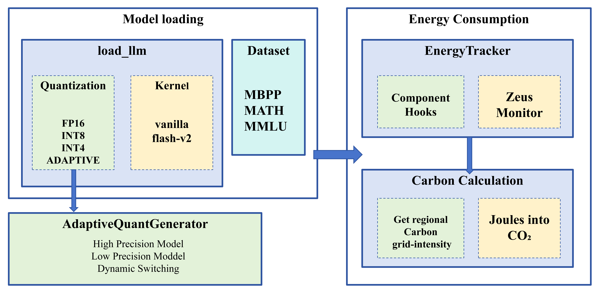

# Adaptive Quantization and Kernel-Level Optimization for Energy-efficient Edge AI Inference of DeepSeek Models

Team Information

- **Team Name**: *Energy-Efficient LLM*
- **Members**
  - Jiayi Yang (jy3475)
  - Feiyang Chen (fc2795)
  - Kuo Gong (kg3175)

------

## 1. Problem Statement

Large-language models (LLMs) deliver impressive accuracy but at a high energy cost.
Our goal is to quantify the trade-offs between accuracy, latency and energy/CO₂ when the same model is deployed with different quantization + attention-kernel combinations, and to test an *adaptive* strategy that switches precision on-the-fly.

------

## 2. Model Description

**Model Suite**

- DeepSeek-Coder 1.3B (Code generation)
- DeepSeek-Qwen 1.5B (General reasoning)

Loaded via Hugging Face; standard Transformer backbone → amenable to low-bit quantization & custom kernels.

**Benchmark Datasets**

- MBPP • Python code generation with embedded test cases
- MATH • Mathematical reasoning, exact-answer format
- MMLU • 57-domain multiple-choice knowledge test

Unified prompt templates ensure fair, cross-task evaluation.

**Solution Architecture**

Our system architecture is modular. The load_llm module handles model instantiation with chosen quantization and kernel. The AdaptiveQuantGenerator manages precision switching. EnergyTracker handles measurements, and we include a CO₂ calculator for sustainability reporting.



## 3. Final Results Summary

Test coder-1.3b-instruct with 50 MBPP samples

| Quantization Mode | Metric                 | Value     |
|-------------------|------------------------|-----------|
| FP16              | Accuracy               | 42%       |
|                   | Average Inference Time | 63.67  s  |
|                   | Energy per Token       | 12.26 J   |
|                   | Training Iterations/s  | 1.57 it/s  |
| INT8              | Accuracy               | 42%       |
|                   | Average Inference Time | 66.17 s      |
|                   | Energy per Token       | 11.87 J    |
|                   | Training Iterations/s  | 1.48 it/s  |
| INT4              | Accuracy               | 32%       |
|                   | Average Inference Time | 60.85 s      |
|                   | Energy per Token       | 11.07 J    |
|                   | Training Iterations/s  | 1.51 it/s  |
| Adaptive          | Accuracy               | 38%       |
|                   | Average Inference Time | 57.44 s      |
|                   | Energy per Token       | 22.86 J     |
|                   | Training Iterations/s  | 1.50 it/s  |


------

## 4. Reproducibility Instructions

### A. Requirements

```
# CUDA-11.x + single NVIDIA T4 GPU  – tested on GCP T4
python -m pip install --upgrade pip setuptools

pip install --upgrade pip setuptools
pip install \
    transformers \
    bitsandbytes \
    zeus-ml \
    torch \
    datasets \
    evaluate \
    scikit-learn \
    geocoder \
    requests \
    numpy \
    wandb
pip install \
    flash-attn==2.0.5 \
    triton==2.0.0 \
    vllm
```

------

### B. Wandb Dashboard

All raw runs & plots: **https://wandb.ai/HPML-Energy-Efficient-LLM**

------

### C. Training / Inference

Our repo only benchmarks **inference**; no additional training is required.

------

### D. Evaluation

#### **Preferred (GCP VM with T4 GPU)**

```
python run_experiment.py \
  --task mbpp \
  --model deepseek-ai/deepseek-coder-1.3b-instruct \
  --modes fp16_vanilla int8_vanilla int4_vanilla \
  --num_examples 50 \
  --out results/results_mbpp_coder_50examples_only_adaptive.json
```

It will:

- Measure per-token energy & latency with `EnergyTracker`
- Switch precision on-the-fly for `"adaptive"` mode
- Print a summary table of **avg energy (J)**, **latency (s)**, **accuracy (%)**, and **CO₂ (g)**
- Save raw metrics to `cfg["output_file"]` (default `results.json`)

------

### E. Quick-start: Minimum Reproducible Result

```
# 1. Clone and install
git clone https://github.com/CowboyPhilip/HPML-Energy-Efficient-LLM.git
cd HPML-Energy-Efficient-LLM
pip install # see A.

# 2. Run a 5-sample smoke test
python run_experiment.py \
  --task mbpp \
  --model deepseek-ai/deepseek-coder-1.3b-instruct \
  --modes fp16_vanilla int8_vanilla int4_vanilla\
  --num_examples 5 \
  --out results/smoke.json
```

This produces a quick JSON with energy/latency/accuracy.

------

## 5. Notes

- Scripts live in `utils/` and the root; entry-point is `run_experiment.py`.
- Energy is measured with **ZeusMonitor**; you can lower overhead by reducing hook granularity in `energy_utils.py`.
- Contact: *jy3475@columbia.edu, fc2795@columbia.edu*, kg3175@columbia.edu
